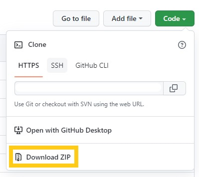
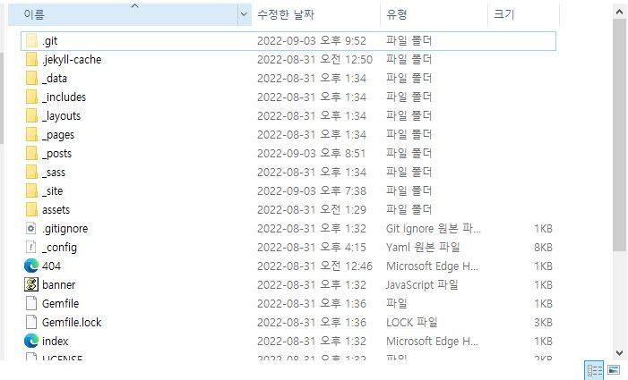
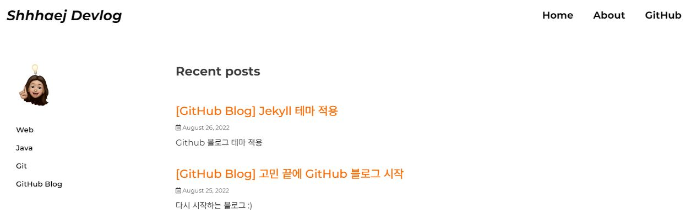
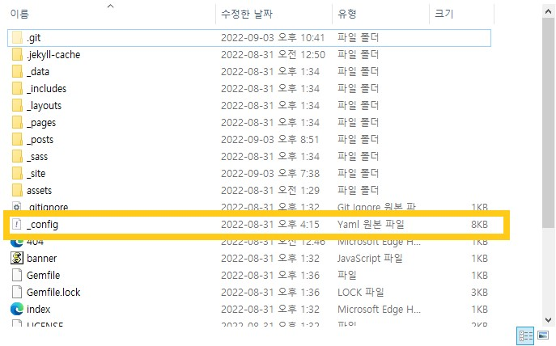

## 테마 선택

테마를 볼 수 있는 사이트가 있다. 

- [jekyll-themes.com](https://jekyll-themes.com/) 
- [jekyllthemes.io](https://jekyllthemes.io/) 
- [jekyllthemes.org](http://jekyllthemes.org/) 
- [jamstackthemes.dev](https://jamstackthemes.dev/ssg/jekyll/) 

 

하지만 난 이미 한 테마 시도 후에 
오류 탈탈 털려서 두번이나 테마 전체 리셋 후에 다시 시도 했다 🥴

그래서 이틀 날리고..... 
한참 테마 고민 끝에 알고 있었던 choiiis님의 블로그 테마를 다시 적용하기로 했다.

원래는 choiiis님의 github를 fork해서 사용중이었는데 
갑자기 사용이 안되는것이더라ㅜㅜ 왜 안되는것이니이.. 멘붕😱

 
 

---

 
 

### 테마 적용하기

- <mark>선택한 테마 링크로 이동</mark>

다른 테마 적용 중 실패를 했고, 
결국 익숙한 choiiis님의 테마로 적용하기로 했다.

 
 
 

- <mark>다운로드</mark>

원하는 테마에서 'Download ZIP' 를 클릭하여 다운로드 한다.

 
 
 

- <mark>다운받은 폴더 열기</mark>

다운받은 폴더를 열고 파일을 전체 복사한다.

 
 
 

- <mark>나의 github.io 폴더에 붙여넣기</mark>

모든파일 '대치하기' 붙여넣기한다.

 
 
 

- <mark>bundle install</mark>

터미널 github.io 폴더 경로에서 

bundle install 를 입력한다.

 
 
 

- <mark>bundle exec jekyll serve</mark>

bundle exec jekyll serve 

해당 명령어를 입력하고, 

http://127.0.0.1:4000 를 주소창에 입력한다.

 

그러면 원하는 테마를 확인할 수 있다 🙂

 
 

---

 
 

## 블로그 설정

- <mark>_congif.yml 파일 열기</mark>

본인의 github.io 폴더에 있는 _congif.yml 파일을 연다.

 
 
 

- <mark>세팅된 설정 변경</mark>

저는 choiiis님 README.md 파일에 안내된 내용대로 설정을 변경한다.

변경 후에 브라우저 리로드하여 확인하면 끝!

혹시 변경내용이 확인 안된다면..? 

터미널에 bundle exec jekyll serve 다시 입력하면 끝!

 
 

당황하지 말고 

jekyll new ./ - -force 를 당당하게 입력한다.

 
 
 

- <mark>bundle install</mark>

bundle install 

위 명령어를 입력한다.

 
 
 

- <mark>Jekyll을 로컬서버로 연결하기</mark>

bundle exec jekyll serve  를 입력하면 로컬서버가 띄워진다.

단...

또 두둥ㅠㅠㅠ

    
Jekyll 4.2.2  Please append '- -trace' to be 'serve' command for any additional information or backtrace.

bundle add webrick 를 입력하면 오류 해결✨

 

그럼 다시 

bundle exec jekyll serve 를 입력

브라우저 주소창에 'http://127.0.0.1:4000' 입력하면..!

 

요로코롬 잘 나오면 성공 오예오예😆🙌

 
 
 

✔️ 참고로!
혹시 bundle exec jekyll serve 를 입력 시,
해당 내용이 떴을 경우에는

이건 오류는 아니고 중복된 파일로 주의하란 문구란다.

그래도 신경쓰이니까 

404.html 
about.markdown 
index.markdown 

파일을 삭제하면 된다.

 
 