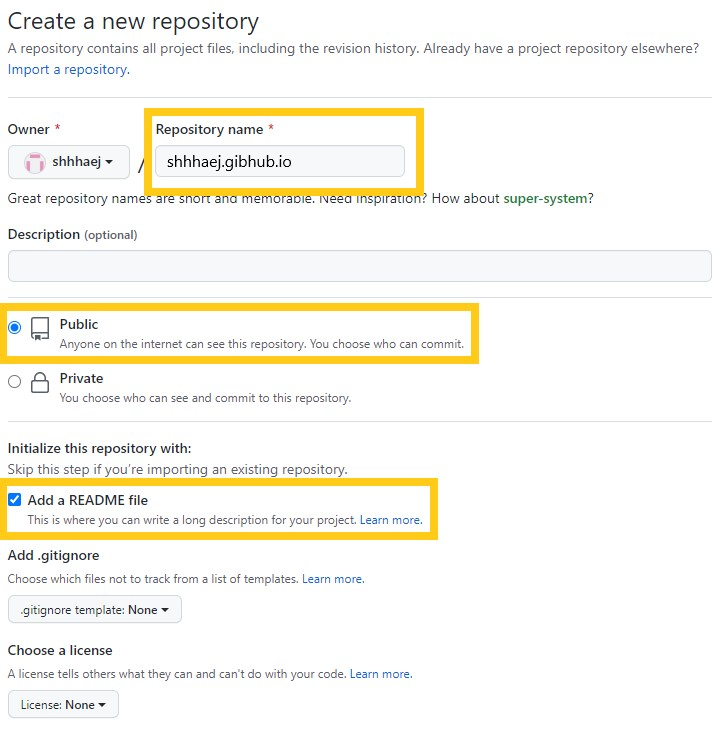
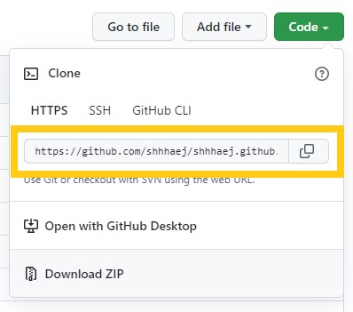
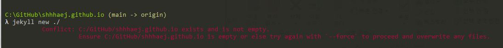
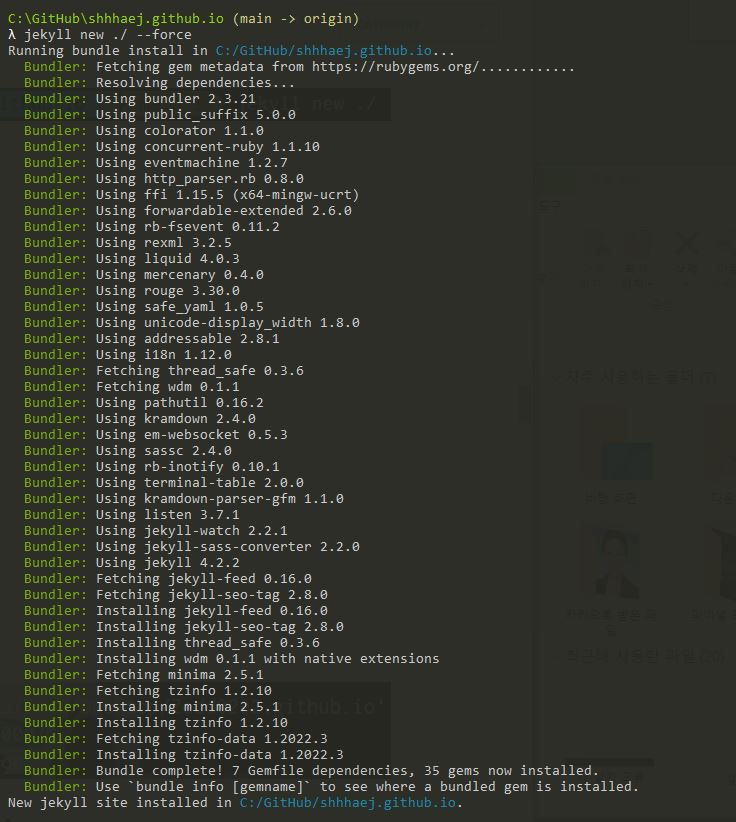
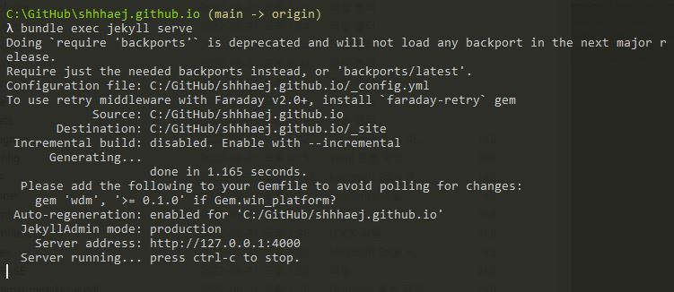
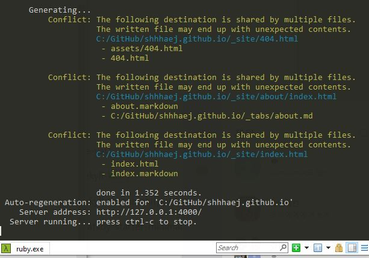

## 테마 선택

테마를 볼 수 있는 사이트가 있다. 

- [jekyll-themes.com](https://jekyll-themes.com/) 
- [jekyllthemes.io](https://jekyllthemes.io/) 
- [jekyllthemes.org](http://jekyllthemes.org/) 
- [jamstackthemes.dev](https://jamstackthemes.dev/ssg/jekyll/) 

하지만 난 이미 한 테마 시도 후에 
오류 탈탈 털려서 두번이나 테마 전체 리셋 후에 다시 시도 했다 🥴

그래서 이틀 날리고.....
한참 테마 고민 끝에 알고 있었던 choiiis님의 블로그 테마를 다시 적용하기로 했다.

원래는 choiiis님의 github를 fork해서 사용중이었는데 
갑자기 사용이 안되는것이더라ㅜㅜ 왜 안되는것이니이.. 멘붕😱

 
 

### 깃허브 블로그 한번 만들어봐!

- <mark>새로운 Repository를 만든다.</mark>

 
 
 

- <mark>Repository 이름을 설정한다.</mark>

💡 꼭 username.github.io 이런식으로 만들어 준다.

 
 
 

- <mark>clone한다.</mark>

원하는 경로로 이동한 다음 터미널을 열어 클론한다.

git clone https://... 복사한 주소

 
 
 

- <mark>clone한 폴더에 추가로 파일 생성한다.</mark>

index.html 파일 생성 (안에 내용은 상관✖️)

터미널에 해당 명령어 입력한다.

echo "Hello World" > index.html

 
 
 

- <mark>Push</mark>

해당 폴더 모두 Push

터미널에 해당 명령어를 입력한다.

git add  
git commit -m "lnitial commit"  
git push -u origin main

 
 
 

- <mark>GitHub repository 확인</mark>

username.github.io repository 확인 시 Push한 파일이 확인 잘 된다면

브라우저 주소창에 username.github.io 입력하면 

짜잔

⭐Github 블로그 완성⭐

다 확인되었다면 index.html 파일 제거한다.

 
 

---

 
 

### Jekyll

- <mark>github.io 폴더에 Jekyll을 설치</mark>

터미널에 gem install jekyll bundler 명령어를 입력한다.

 
 
 

- <mark>Jekyll 생성</mark>

jekyll new ./  

명령어를 입력한다.

이때 뚜둥!

Conflict: C:/GitHub/shhhaej.github.io exists and is not empty. 
          Ensure C:/GitHub/shhhaej.github.io is empty or else try again with '-  -force' to proceed and overwrite any files.

오류가 발생되었...🤦

 
 

당황하지 말고 

jekyll new ./ - -force 를 당당하게 입력한다.

 
 
 

- <mark>bundle install</mark>

bundle install 

위 명령어를 입력한다.

 
 
 

- <mark>Jekyll을 로컬서버로 연결하기</mark>

bundle exec jekyll serve  를 입력하면 로컬서버가 띄워진다.

단...

또 두둥ㅠㅠㅠ

    
Jekyll 4.2.2  Please append '- -trace' to be 'serve' command for any additional information or backtrace.

bundle add webrick 를 입력하면 오류 해결✨

 

그럼 다시 

bundle exec jekyll serve 를 입력

브라우저 주소창에 'http://127.0.0.1:4000' 입력하면..!

 

요로코롬 잘 나오면 성공 오예오예😆🙌

 
 
 

✔️ 참고로!
혹시 bundle exec jekyll serve 를 입력 시,
해당 내용이 떴을 경우에는

이건 오류는 아니고 중복된 파일로 주의하란 문구란다.

그래도 신경쓰이니까 

404.html 
about.markdown 
index.markdown 

파일을 삭제하면 된다.

 
 