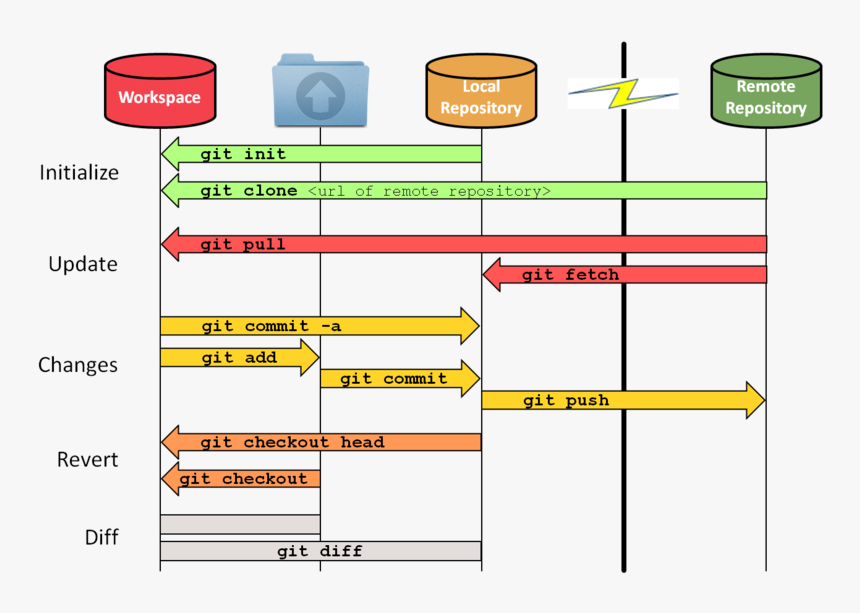

## Git Workflow 

💡 두루뭉실하던 흐름에 도움이 된 사진

 
 
 

### Github 명령어

 - git init : 로컬 폴더에 git 파일 생성

 - git remote add origin https://github.com/(repository 주소)  : 로컬 저장소와 깃허브 저장소 연동

 - git status : 현재 로컬 저장소 상태 확인

 - git add .  : 변경된 파일 스테이징

 - git commit -m "커밋 메시지" : 변경된 내용 등록 (아직 저장소에 반영✖️)

 - git log : 커밋 된 내용 확인

 - gitk - - all : GUI로 로그 확인 가능

 - git push origin main : 로컬 파일 저장소에 반영

 - git pull origin main : 저장소 파일 로컬에 반영

 - git clone https://github.com/(repository 주소) : 

 
 